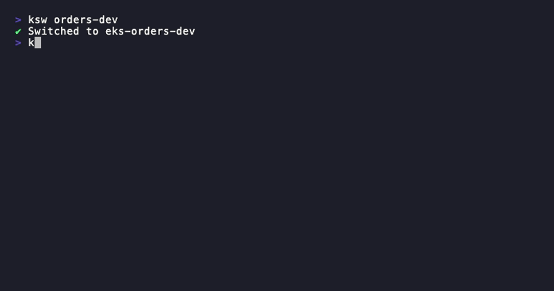

# ksw

**AI-powered** Kubernetes context switcher for your terminal. Built in Go.

🌐 **[yoniergomez.github.io/ksw](https://yoniergomez.github.io/ksw/)**

[](https://github.com/YonierGomez/ksw/releases/latest)
[](LICENSE)
[](go.mod)
[](https://github.com/YonierGomez/ksw/releases/latest)
[](https://github.com/YonierGomez/ksw/releases/latest)
[](https://github.com/YonierGomez/ksw/stargazers)

Switch contexts with natural language, manage groups, pins and aliases. Sync AWS SSO profiles and EKS clusters to kubeconfig automatically. Single binary, no runtime dependencies.

> Available for **macOS** and **Linux** (amd64 & arm64).

### Interactive TUI


### AI — Natural Language


---

## Features

### Free

- **Fuzzy search** — type any part of a context name to filter instantly
- **Short-name switching** — `ksw payments-dev` instead of the full ARN
- **Aliases** — `ksw @prod` gets you there instantly
- **Pins** — pin favorites to always appear at the top (`Ctrl+P` in TUI)
- **Groups** — organize contexts and open TUI filtered to a group
- **Previous context** — `ksw -` toggles back like `cd -` in bash
- **History** — `ksw history` shows last 10 contexts, `ksw history 3` jumps to any
- **AI natural language** — switch, create, list, rename — just describe what you want
- **EKS kubeconfig sync** — discover and add EKS clusters to kubeconfig in parallel
- **EKS TUI** (`ksw eks config`) — interactive manager for kubeconfig: sync, view clusters, remove stale
- **Shell completion** — zsh and bash

### ★ Premium

> Get a license at **[ksw.lemonsqueezy.com/checkout](https://ksw.lemonsqueezy.com/checkout/buy/5b89e2bc-9b58-4343-84d3-2dcbf22d67a1)**

- **AWS SSO config TUI** (`ksw aws sso config`) — create, edit, delete SSO sessions, login, sync profiles and kubeconfig — all from an interactive TUI
- **AWS SSO login** (`ksw aws sso login`) — login to any configured SSO session
- **Profile sync** (`ksw aws sso profiles sync`) — auto-scan SSO accounts and sync all profiles to `~/.aws/config` with live progress
- **Profile management** (`ksw aws sso profiles list/add/search`) — list, add and search AWS profiles

---

## Install

### One-line installer (macOS & Linux — easiest)

```bash
curl -sL https://raw.githubusercontent.com/YonierGomez/ksw/main/install.sh | bash
```

### Homebrew (macOS & Linux)

```bash
brew tap YonierGomez/ksw
brew install ksw
```

### Manual — Linux

```bash
# amd64 (x86_64)
curl -sL https://github.com/YonierGomez/ksw/releases/latest/download/ksw-linux-amd64.tar.gz | tar xz
chmod +x ksw-linux-amd64
sudo mv ksw-linux-amd64 /usr/local/bin/ksw

# arm64 (AWS Graviton, Raspberry Pi, etc.)
curl -sL https://github.com/YonierGomez/ksw/releases/latest/download/ksw-linux-arm64.tar.gz | tar xz
chmod +x ksw-linux-arm64
sudo mv ksw-linux-arm64 /usr/local/bin/ksw
```

### Manual — macOS

```bash
# Apple Silicon (M1/M2/M3/M4)
curl -sL https://github.com/YonierGomez/ksw/releases/latest/download/ksw-darwin-arm64.tar.gz | tar xz
chmod +x ksw-darwin-arm64
sudo mv ksw-darwin-arm64 /usr/local/bin/ksw

# Intel
curl -sL https://github.com/YonierGomez/ksw/releases/latest/download/ksw-darwin-amd64.tar.gz | tar xz
chmod +x ksw-darwin-amd64
sudo mv ksw-darwin-amd64 /usr/local/bin/ksw
```

### From source

```bash
go install github.com/YonierGomez/ksw@latest
```

---

## Usage

```bash
# ── Context ──
ksw                              # Interactive TUI (fuzzy search)
ksw <name>                       # Switch directly (short name ok)
ksw -                            # Switch to previous context
ksw rename <old> <new>           # Rename a context in kubeconfig
ksw -l                           # List contexts (non-interactive)

# ── AI ──
ksw ai "<query>"                 # Natural language: switch, create, list, delete...
ksw ai chat                      # Interactive conversational mode (multi-turn)
ksw ai config                    # Configure AI provider (openai, claude, gemini, bedrock)

# ── Aliases ──
ksw @<alias>                     # Switch using alias
ksw alias <name> <context>       # Create alias
ksw alias rm <name>              # Remove alias
ksw alias ls                     # List aliases

# ── Pins ──
ksw pin <name>                   # Pin context to top of list
ksw pin rm <name>                # Unpin
ksw pin ls                       # List pins
ksw pin use                      # TUI filtered to pinned only

# ── Groups ──
ksw group add <name> [ctx...]    # Create group (glob ok: "eks-pay*")
ksw group rm <name>              # Remove group
ksw group ls                     # List groups
ksw group use <name>             # TUI filtered to group
ksw group add-ctx <g> <ctx>      # Add context to group
ksw group rmi <g> <ctx>          # Remove context from group

# ── History ──
ksw history                      # Show recent context history
ksw history <n>                  # Switch to history entry by number

# ── EKS ──
ksw eks config                   # Interactive EKS / kubeconfig manager (TUI)
ksw eks kubeconfig sync          # Sync EKS clusters → ~/.kube/config
ksw eks kubeconfig sync --profile <n>  # Sync only one AWS profile

# ── AWS SSO [premium] ──
ksw aws sso config               # Interactive SSO session manager (TUI)
ksw aws sso login                # Login to default SSO session
ksw aws sso login <session>      # Login to a specific SSO session
ksw aws sso profiles list        # List configured AWS profiles
ksw aws sso profiles sync        # Auto-sync SSO accounts to ~/.aws/config
ksw aws sso profiles add <n> <id>  # Add a single profile
ksw aws sso profiles search <t>  # Search profiles by name or account ID

# ── License ──
ksw license activate             # Activate interactively (key hidden)
ksw license activate <key>       # Activate with key as argument
ksw license deactivate           # Remove license (frees slot to move to another machine)
ksw license buy                  # Open checkout in browser
ksw license status               # Show license status

# ── Shell Completion ──
ksw completion install           # Auto-install in ~/.zshrc or ~/.bashrc
ksw completion zsh               # Print zsh setup line
ksw completion bash              # Print bash setup line

# ── Other ──
ksw -h, --help                   # Help
ksw -v, --version                # Version
```

### Interactive TUI Navigation

| Key          | Action                              |
|--------------|-------------------------------------|
| Type         | Fuzzy filter in real time           |
| `↑` / `↓`   | Move up / down                      |
| `Home`/`End` | Go to top / bottom                  |
| `PgUp/PgDn`  | Jump 10 items                       |
| `Backspace`  | Delete filter character             |
| `Enter`      | Switch to highlighted context       |
| `Ctrl+P`     | Pin / unpin current context (★)     |
| `Ctrl+T`     | Jump to first pinned context        |
| `Ctrl+F`     | Toggle pinned-only filter           |
| `Ctrl+H`     | Toggle short name view (persisted)  |
| `Esc`        | Clear filter / Quit                 |
| `Ctrl+C`     | Quit                                |

---

## AI — Natural Language

```bash
ksw ai "switch to payments dev"
# ✔ Switched to arn:aws:eks:us-east-1:111122223333:cluster/eks-payments-dev

ksw ai "create a group called backend with payments and orders dev"
# ✔ Group 'backend' created (2 contexts)

# Conversational memory — remembers last 10 interactions
ksw ai "switch to sufi qa"
ksw ai "now the same but in dev"
# ✔ Switched to arn:.../eks-sufi-dev

ksw ai "go back to the previous one"
# ✔ Switched to arn:.../eks-sufi-qa

ksw ai "list my pins and groups as a table"
# AI builds a formatted table from your current state

ksw ai chat           # Interactive conversational TUI
ksw ai config         # Setup wizard: provider, model, credentials
```

### Supported AI Providers

| Provider | Models | Auth |
|----------|--------|------|
| OpenAI | gpt-4o, gpt-4o-mini, etc. | API Key |
| Claude (Anthropic) | claude-sonnet-4-20250514, etc. | API Key |
| Gemini (Google) | gemini-2.0-flash, etc. | API Key |
| AWS Bedrock | Claude, Llama, etc. | AWS Profile / Access Keys / Env vars |

---

## EKS Kubeconfig Sync

Discover and add all your EKS clusters to kubeconfig automatically. Parallel discovery with live progress bar.

```bash
# Interactive TUI — sync, view clusters, remove stale
ksw eks config

# CLI — sync all profiles
ksw eks kubeconfig sync
#   ⠸ Scanning profiles... ████████████░░░░░░░░  127 / 257
#   ✔ profile 'payments-dev' [us-east-1] — 2 cluster(s) found
#   ✔ added eks-payments-dev  (payments-dev)
#   ✔ Done — 3 added, 12 skipped, 0 failed

# Sync only one profile
ksw eks kubeconfig sync --profile payments-dev
```

---

## AWS SSO — Premium

Manage AWS SSO sessions and profiles from an interactive TUI. Automatically sync all accounts and roles to `~/.aws/config`.

```bash
# Activate license first
ksw license activate

# Interactive TUI — sessions, login, sync profiles, sync kubeconfig
ksw aws sso config

# Login
ksw aws sso login
ksw aws sso login my-session

# Sync all SSO accounts to ~/.aws/config
ksw aws sso profiles sync

# List / search profiles
ksw aws sso profiles list
ksw aws sso profiles search payments
```

---

## License (Premium)

```bash
# Activate (interactive — key is hidden)
ksw license activate

# Activate with key directly
ksw license activate XXXXXXXX-XXXX-XXXX-XXXX-XXXXXXXXXXXX

# Check status
ksw license status

# Moving to a new machine? Deactivate first to free the slot
ksw license deactivate

# Open checkout in browser
ksw license buy
```

Get a license at **[ksw.lemonsqueezy.com/checkout](https://ksw.lemonsqueezy.com/checkout/buy/5b89e2bc-9b58-4343-84d3-2dcbf22d67a1)**

---

## Configuration

All settings are stored in `~/.ksw.json`:

```json
{
  "aliases": { "prod": "arn:aws:eks:us-east-1:111122223333:cluster/eks-payments-dev" },
  "pins": ["arn:aws:eks:us-east-1:111122223333:cluster/eks-payments-dev"],
  "history": ["arn:aws:eks:.../eks-payments-dev", "arn:aws:eks:.../eks-payments-qa"],
  "previous": "arn:aws:eks:us-east-1:444455556666:cluster/eks-payments-qa",
  "ai": {
    "provider": "bedrock",
    "model": "us.anthropic.claude-sonnet-4-6",
    "region": "us-east-1",
    "auth_method": "profile",
    "profile": "my-aws-profile"
  },
  "sso_sessions": {
    "my-company": {
      "session_name": "my-company",
      "start_url": "https://d-xxxxxxxx.awsapps.com/start/#",
      "sso_region": "us-east-1"
    }
  },
  "license": {
    "key_enc": "<encrypted>",
    "email": "you@company.com",
    "instance_id": "...",
    "activated_at": "2026-03-17T..."
  }
}
```

## Requirements

- `kubectl` installed and configured
- For `ksw ai` with AWS Bedrock: `aws` CLI installed and configured
- For `ksw eks kubeconfig sync`: `aws` CLI with profiles in `~/.aws/config`
- For `ksw aws sso`: premium license + `aws` CLI

## Roadmap

- [x] `ksw eks kubeconfig sync` — auto-sync EKS clusters to kubeconfig ✅
- [x] `ksw eks config` — interactive EKS / kubeconfig TUI ✅
- [x] `ksw aws sso config` — AWS SSO session manager ✅
- [x] `ksw aws sso profiles sync` — auto-sync SSO profiles ✅
- [x] Premium licensing via Lemon Squeezy ✅
- [ ] `ksw ai` — support for local models (Ollama)
- [ ] `ksw diff` — compare two contexts side by side
- [ ] `ksw export` / `ksw import` — share config across machines
- [ ] Namespace switching within a context
- [ ] Shell prompt integration (PS1 / starship)

Have an idea? [Open an issue](https://github.com/YonierGomez/ksw/issues/new) or send a PR.

## License

MIT — Built by [Yonier Gómez](https://www.yonier.com) · [GitHub](https://github.com/YonierGomez) · [LinkedIn](https://www.linkedin.com/in/yoniergomez/)

---

If ksw saves you time, consider [buying me a coffee ☕](https://buymeacoffee.com/yoniergomez)
